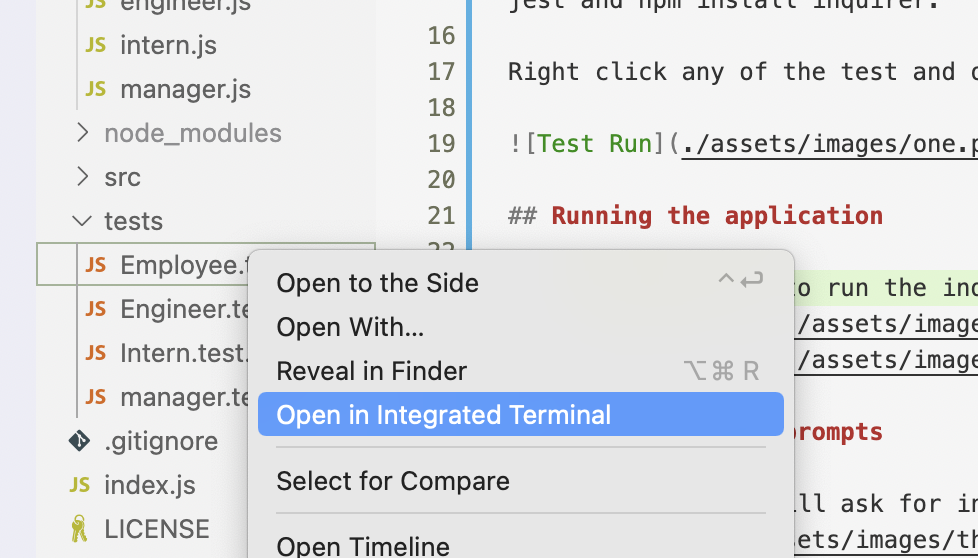
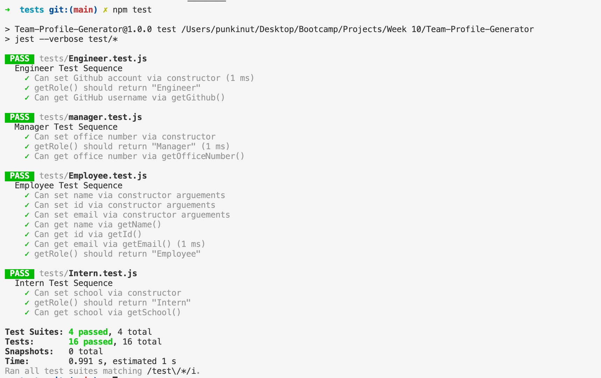
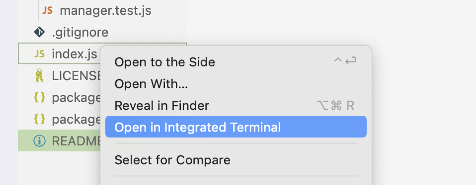
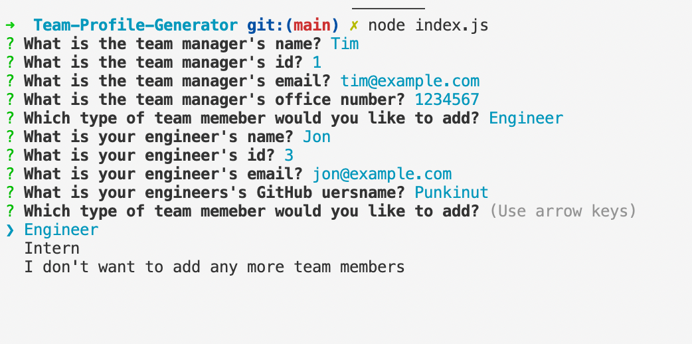
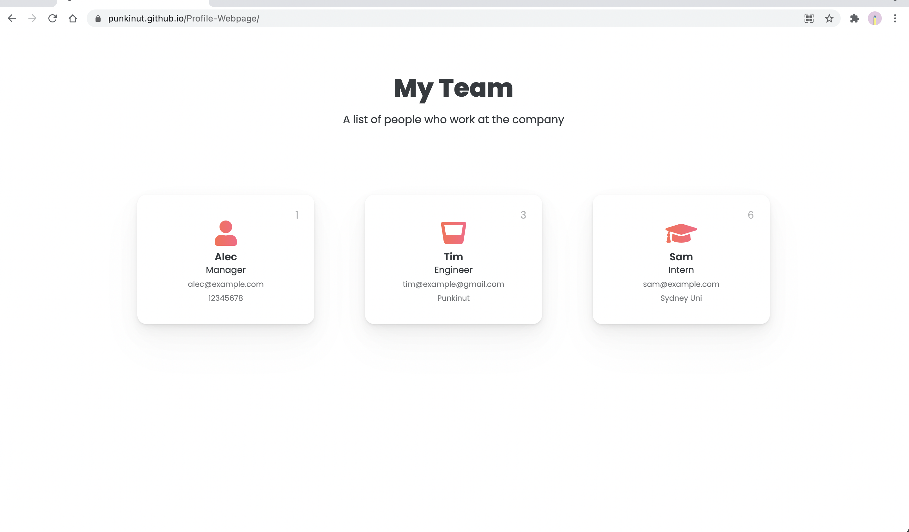

# Team Profile Generator

## Deployment

In order to deploy the application you will have to execute it in node (see running the application section).  
Link to demonstration video: [Demo Video](https://www.youtube.com/watch?v=D4kiFozEHzg)  
Link to webpage demonstration: [Demo Webpage](https://punkinut.github.io/Profile-Webpage/)

## Why make this?
This is designed for managers in any workforce who want to list out their team members and have it displayed on a webpage. This is a very simple application that makes it easier to generate a website!

## My goal
The goal was to generate a very clean user interface and error prone program so that any user understands how the application works.

## Running the tests
In the file directory you will need to install third party npm packages by opening it in your terminal and call npm init -y, npm install jest and npm install inquirer.

Right click any of the test and open it up in the terminal and type npm test.

## Running the application

Here you will need to run the index.js file in the terminal on mac.  

## Filling out the prompts

Here the computer will ask for information that will apply to the final html file.  

## Created Webpage

This is an example of a generated webpage

## End note
I hope you enjoyed going through my application and hopefully you will be able to create a polished list of your team mates :)
